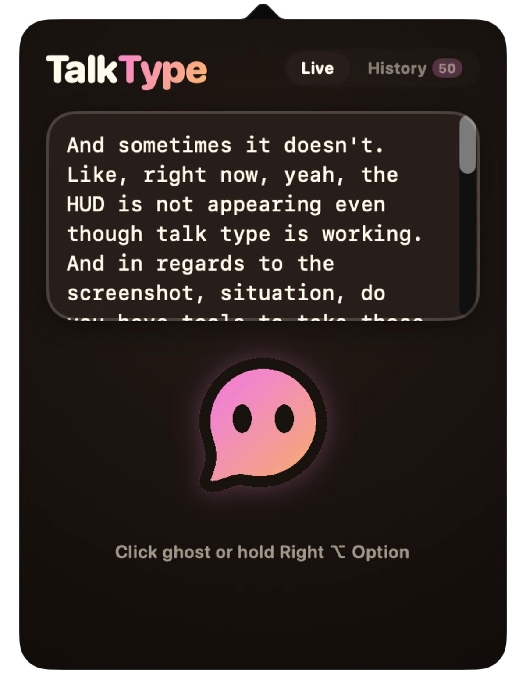

# TalkType for Mac 👻



Menu-bar dictation with the ghost. Click the ghost (or hold ⌥ Right Option anywhere), talk, and the text pastes straight into whatever app has focus.

First launch opens a three-step welcome guide (pick your key → permissions → say something). Reopen it any time from the right-click menu → Welcome Guide….

Three engines, one ghost:

- **Apple on-device** — free, offline, 100% private. No key, zero network.
- **Deepgram live** — bring your own key for realtime cloud streaming accuracy (Nova-3).
- **Gemini polish** — optional BYOK pass that cleans dictation into polished prose.

Strictly **English** and **Spanish** — auto-detects your macOS system locale or switch manually in the menu. Zero unwanted language jumping.

## The shortcut

Hold to talk, release to paste. The details are what make it feel solid:

- **Exclusive press.** The key only starts a take when it is the *only* modifier down, so ⌥⌘I,
  ⌥e (é) and friends never trigger it. If you press another key while holding the modifier,
  the take is cancelled: you were typing, not dictating.
- **Escape cancels.** Throw the take away, nothing is pasted.
- **Tap to Lock (off by default).** A quick tap locks the mic on hands-free; tap again to
  finish. Toggle it under Push to Talk Key in the menu.
- **Never stuck.** While the key is held, TalkType polls the real hardware modifier state; if
  macOS swallowed the key-up (modal dialog, secure input field, Space switch) it recovers
  within half a second. Every take also has a hard 5-minute cap.
- **⌃⌥ Space works everywhere.** The modifier-only keys need Accessibility (that is how
  macOS delivers global modifier events). ⌃⌥ Space is a Carbon hot key and needs no
  permission at all, sandbox included, so it is the default in the App Store build.

## The engine

Every take is a numbered session. Recognizer callbacks, socket messages and timers carry the
session they belong to and are dropped when stale, so a late result from take #3 can never
stop, hide or paste over take #4 (this was the "HUD vanished but it kept working" bug).
Every session ends exactly once: final result, error, or a finalize timeout that delivers the
last partial. The Deepgram path sends `Finalize` on release and waits for the flushed final
before closing. Permission problems show up as a message in the HUD instead of silence.

## Build

```bash
./build.sh direct     # compiles + signs (Developer ID) + builds a notarized-ready DMG
./build.sh mas        # sandboxed App Store target (requires MAS certs)
UNIVERSAL=1 ./build.sh mas          # fat arm64 + x86_64 binary
VERSION=1.0.1 BUILD_NUMBER=2 ./build.sh mas
open build/TalkType.app
```

Install with `ditto build/TalkType.app /Applications/TalkType.app`.

Notarization is wired into `build.sh` (it staples the DMG). It skips gracefully until you
create a notary profile once:

```bash
xcrun notarytool store-credentials "talktype-notary" \
  --apple-id <apple-id-email> --team-id V433H655PN --password <app-specific-password>
```

## Two things that will waste your afternoon if you don't know them

**1. The entry point is explicit, on purpose.** `@main` on an `NSApplicationDelegate`
goes through `NSApplicationMain`, which expects a nib to install the delegate. There is
no nib here, so `applicationDidFinishLaunching` never fires: the app launches, sits
there doing nothing, and shows no menu bar item. `AppDelegate.main()` wires the delegate
by hand instead. Do not "simplify" it back.

**2. Signing is why permissions stick.** TCC remembers an app by its *designated
requirement*. Ad-hoc signing yields `designated => cdhash H"..."` — a hash of the binary
— so every rebuild looks like a brand new app and macOS re-prompts for mic, speech and
accessibility every single time. `build.sh` signs with the Developer ID when it is in
the keychain, giving an identifier + team-ID requirement that survives rebuilds.
Verify with `codesign -d -r- build/TalkType.app`.

Direct distribution uses hardened runtime (`--options runtime`) with the
`com.apple.security.device.audio-input` entitlement — both together, so the mic survives.
The App Store target uses the sandbox entitlements instead.

## Permissions

The welcome guide asks for Microphone and Speech Recognition one at a time. Accessibility
must be granted by hand in System Settings → Privacy & Security → Accessibility — it covers
the modifier-key push-to-talk monitor, the Cmd+V paste and the "show the HUD on the screen
where the focused window is" trick. Without it, TalkType still works: ⌃⌥ Space as the key,
and text lands on the clipboard with a ⌘V reminder in the HUD.

This is the same in the App Store build. The sandbox does not stop a user granting
Accessibility (Magnet, on the store, requires it outright); what App Review wants is that the
app still works without it, which it does. So the store build defaults to ⌃⌥ Space and
clipboard, and lights up modifier keys + auto-paste the moment Accessibility is granted.

## App Store checklist

What `./build.sh mas` already does: sandbox entitlements (audio-input, network client),
`ITSAppUsesNonExemptEncryption = false` (HTTPS only, so no export-compliance questionnaire),
`DTSDK*`/`DTXcode*` toolchain keys, `CFBundleSupportedPlatforms`, `PrivacyInfo.xcprivacy`,
and an embedded provisioning profile when `TalkType.provisionprofile` sits next to `build.sh`.

Still on you, in order:

1. **Certificates.** "Apple Distribution" (or "3rd Party Mac Developer Application") and
   "3rd Party Mac Developer Installer" in the login keychain. The script picks them up.
2. **Provisioning profile.** App Store Connect → Certificates, Identifiers & Profiles →
   Profiles → Mac App Store Connect, bundle id `com.pibulus.talktype`. Save it as
   `TalkType.provisionprofile` in the repo root (gitignored).
3. **App record.** App Store Connect → New App, same bundle id, category Productivity.
   Privacy nutrition label: "Data Not Collected" (nothing leaves the Mac by default; BYOK
   Deepgram/Gemini are user-supplied and off by default — say so in Review Notes).
4. **Build & validate.** `VERSION=1.0 BUILD_NUMBER=1 ./build.sh mas`, then
   `xcrun altool --validate-app -f dist/TalkType-1.0.pkg -t macos --apiKey … --apiIssuer …`
   or drag the .pkg into Transporter. Bump `BUILD_NUMBER` on every upload.
5. **Screenshots.** 2880×1800 (or 1440×900) PNGs, `screenshots/appstore-2880x1800.png` is one.
   Show the HUD over a real app, the popover, and the welcome guide.
6. **Review notes.** Say it is a menu bar app (no Dock icon, `LSUIElement`), that the
   default shortcut is ⌃⌥ Space, that Accessibility is *optional* (without it: text is
   copied to the clipboard; with it: modifier-key shortcut and automatic paste into the
   focused app), and how to test both: open TextEdit, hold ⌃⌥ Space, speak, release, ⌘V;
   then grant Accessibility and repeat, the text appears on its own.
7. **Intel.** The default build is Apple Silicon only, which the store allows. Ship
   `UNIVERSAL=1` if you want Intel Macs too.

## Keys & polish

API keys (Deepgram, Gemini) are stored in the Keychain, never in plaintext. A one-time
migration moves any legacy `UserDefaults` key automatically.

## Design

Palette is shared with talktype.app and the browser extension, sourced from
`talktype/src/app.css` and `ghost/gradients.js`. Cream `#fff6e6` paper, warm ink
`#1e1714`, peach ghost gradient. Dark mode inverts to warm near-black — never `#000`.
Ghost assets in `Assets/` are rendered from `talktype/static/talktype-icon.svg`.
