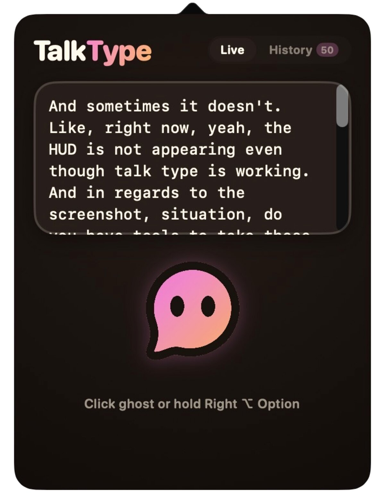

# TalkType for Mac 👻



Menu-bar dictation with the ghost. Click the ghost to dictate. The direct build can paste into your app with Accessibility permission; the Mac App Store build copies text and shows a ⌘V reminder.

Three engines, one ghost:

- **Apple on-device** — no key and no audio sent to Apple. Requires on-device recognition support for the selected language; otherwise TalkType shows an error instead of using server recognition.
- **Deepgram live** — bring your own key for realtime cloud streaming accuracy (Nova-3).
- **Gemini polish** — optional BYOK pass that cleans dictation into polished prose.

Strictly **English** and **Spanish** — auto-detects your macOS system locale or switch manually in the menu. Zero unwanted language jumping.

## The shortcut

- **Direct build:** hold either ⌥ Option key to dictate and release to finish. A tap shorter than 280 ms starts hands-free recording; tap again to finish. Other modifier choices are available in the menu. Global modifier monitoring requires Accessibility; the menu-bar control works without it. There is no Escape-to-cancel or ordinary-key cancellation handler.
- **Mac App Store build:** hold ⌃⌥ Space to dictate and release to copy. This Carbon hotkey does not require Accessibility. If another app has registered the shortcut, TalkType reports the conflict and remains usable from the menu bar.
- **During processing:** another take is blocked until the current transcript is delivered. Fast releases are consumed rather than discarded by a time-based debounce.

## The engine

Recognition callbacks and completion deadlines belong to their original session. Deepgram sends `CloseStream` after queued audio drains, waits for the server's final results and metadata, and has a five-second completion deadline. Apple Speech preserves a useful partial when a final result is empty and stops on service errors instead of retrying indefinitely. Cloud fallback stops the backend actually running, regardless of the saved preference.

Audio route changes, sleep, and a stalled input stream stop the current capture. TalkType explicitly removes its tap before resetting the engine. Already transcribed words are retained; automatic route recovery within the same take is not implemented.

## Build

```bash
./build.sh direct     # requires Developer ID, notarization, stapling, and Gatekeeper acceptance
./build.sh mas        # sandboxed App Store target (requires MAS certs)
UNIVERSAL=1 ./build.sh mas          # fat arm64 + x86_64 binary
VERSION=1.0.1 BUILD_NUMBER=2 ./build.sh mas
LOCAL_BUILD=1 ./build.sh direct    # explicitly labeled local test DMG; no notarization upload
ALLOW_ADHOC_MAS=1 ./build.sh mas    # sandboxed local test when MAS certificates are absent
open build/TalkType.app
```

Install with `ditto build/TalkType.app /Applications/TalkType.app`.

The direct release target requires a `Developer ID Application` certificate, enables Hardened Runtime, and packages a DMG via `create-dmg` with an `hdiutil` fallback. It uses `NOTARY_PROFILE`, or a stored `AC_PASSWORD` / `talktype-notary` profile, to notarize and staple. Missing tickets, notarization failures, and Gatekeeper rejection fail the release build and remove the image. Local test images use the `-LOCAL-ONLY.dmg` suffix. Build commands replace `build/` and `dist/`; preserve a release before building the other mode.

If `notarytool` returns HTTP 403 with a missing or expired agreement, the Apple Developer account holder must resolve the required agreement before notarization can continue. Replacing a working Keychain profile does not resolve that server-side rejection.

## Permissions

The direct build uses Accessibility for global modifier monitoring and automatic ⌘V insertion. Without it, start dictation from the menu bar and paste the copied text yourself.

The Mac App Store build uses ⌃⌥ Space and clipboard delivery. It does not enable modifier monitoring or synthetic paste when Accessibility is granted. Both builds require microphone permission; Apple Speech additionally requires Speech Recognition permission and available on-device support.

## App Store checklist

What `./build.sh mas` already does: sandbox entitlements (audio-input, network client), `ITSAppUsesNonExemptEncryption = false` (HTTPS only, so no export-compliance questionnaire), `DTSDK*`/`DTXcode*` toolchain keys, `CFBundleSupportedPlatforms`, `PrivacyInfo.xcprivacy`, and an embedded provisioning profile when `TalkType.provisionprofile` sits next to `build.sh`.

Still on you, in order:

1. **Certificates.** "Apple Distribution" (or "3rd Party Mac Developer Application") and "3rd Party Mac Developer Installer" in the login keychain. The script picks them up.
2. **Provisioning profile.** Required for TestFlight or restricted capabilities. Create a Mac App Store Connect profile for `com.pibulus.talktype` and save it as `TalkType.provisionprofile` (gitignored). Basic sandbox entitlements alone do not require one for Mac App Store distribution.
3. **App record and privacy.** Use the same bundle id and Productivity category. Complete privacy answers for the actual release, including optional Deepgram audio and Gemini transcript processing and the providers' retention practices. BYOK and opt-in defaults alone do not determine the correct privacy label.
4. **Build & validate.** `VERSION=1.0 BUILD_NUMBER=1 ./build.sh mas`, then `xcrun altool --validate-app -f dist/TalkType-1.0.pkg -t macos --apiKey … --apiIssuer …` or drag the .pkg into Transporter. Bump `BUILD_NUMBER` on every upload.
5. **Screenshots.** 2880×1800 (or 1440×900) PNGs, `screenshots/appstore-2880x1800.png` is one. Show the HUD over a real app and the popover.
6. **Review notes.** Explain that this is a menu bar app with no Dock icon (`LSUIElement`). Grant microphone and Speech Recognition access, then open TextEdit, hold ⌃⌥ Space, speak, release, and press ⌘V. MAS delivery is always clipboard-only and never requires Accessibility. Explain how to select a supported local language and configure the optional cloud services.
7. **Intel.** The default build is Apple Silicon only, which the store allows. Ship `UNIVERSAL=1` if you want Intel Macs too.

## Keys & polish

API keys (Deepgram, Gemini) are stored in the Keychain, never in plaintext. A one-time
migration moves any legacy `UserDefaults` key automatically.

## Regression checks

Run `Tests/run-regressions.sh` to exercise transcript finalization, stale callbacks, fallback stopping, Keychain errors, audio buffer ownership, modifier release, URL escaping, and release build gates. Tests use isolated preferences, mocked Keychain calls and signing tools, and unstarted sockets; they capture no microphone audio.

Before release, also test real microphone/AirPods route changes, sleep/wake, full-screen HUD behavior, and denied-permission flows on the supported macOS versions. Automated checks and notarization do not guarantee App Review approval.

## Design

Palette is shared with talktype.app and the browser extension, sourced from
`talktype/src/app.css` and `ghost/gradients.js`. Cream `#fff6e6` paper, warm ink
`#1e1714`, peach ghost gradient. Dark mode inverts to warm near-black — never `#000`.
Ghost assets in `Assets/` are rendered from `talktype/static/talktype-icon.svg`.
